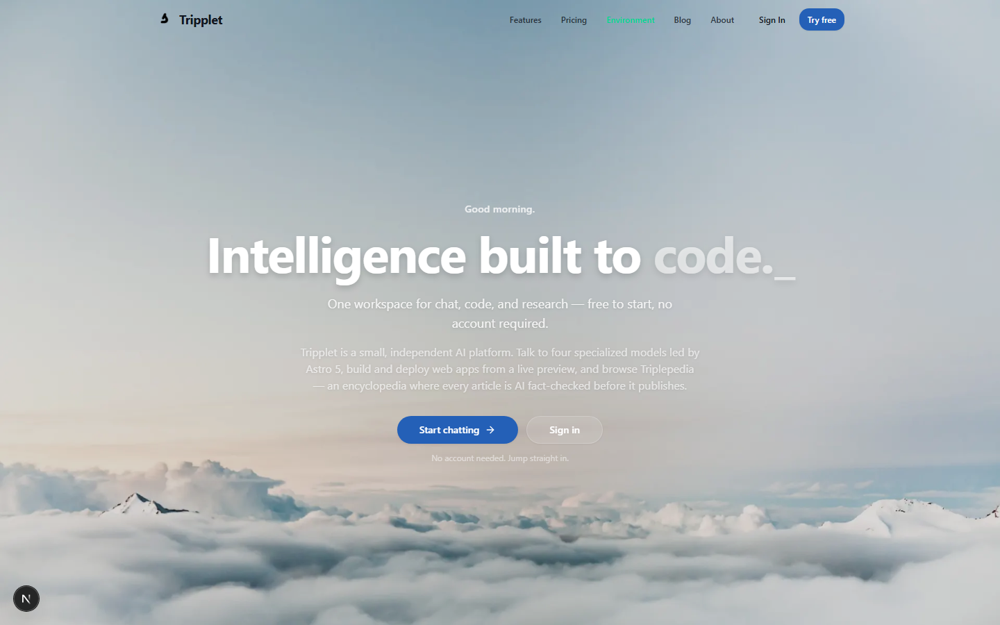
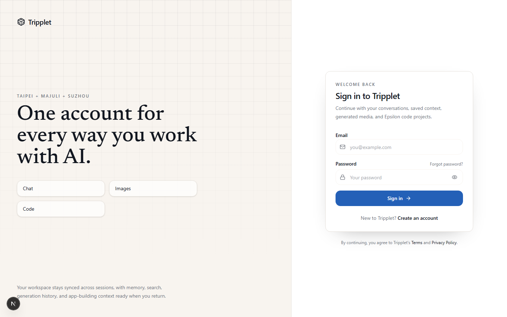
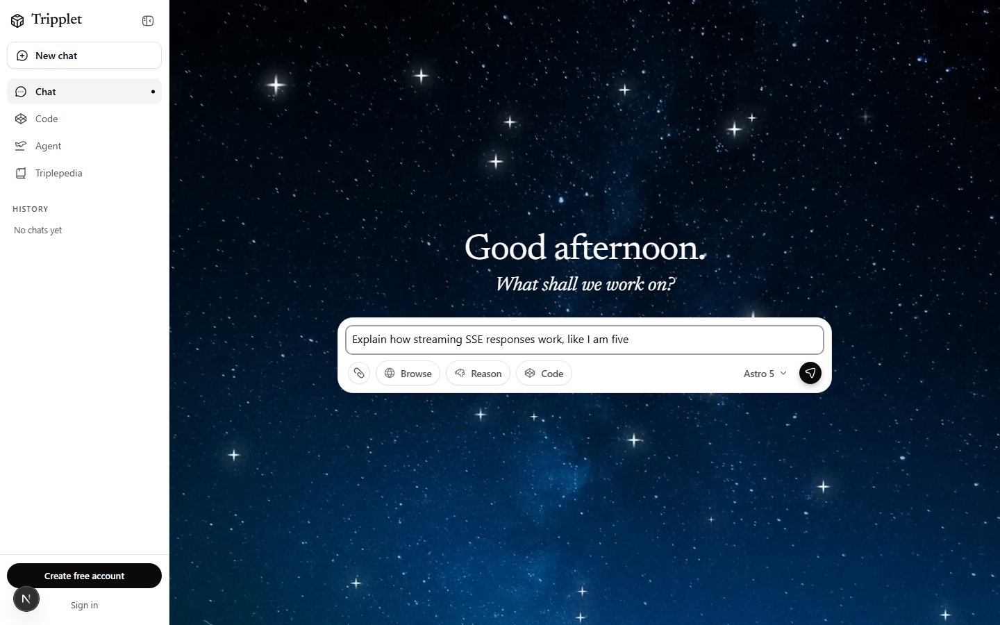
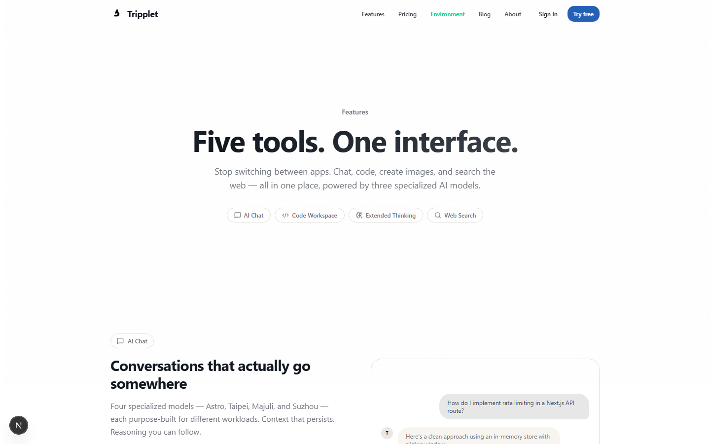
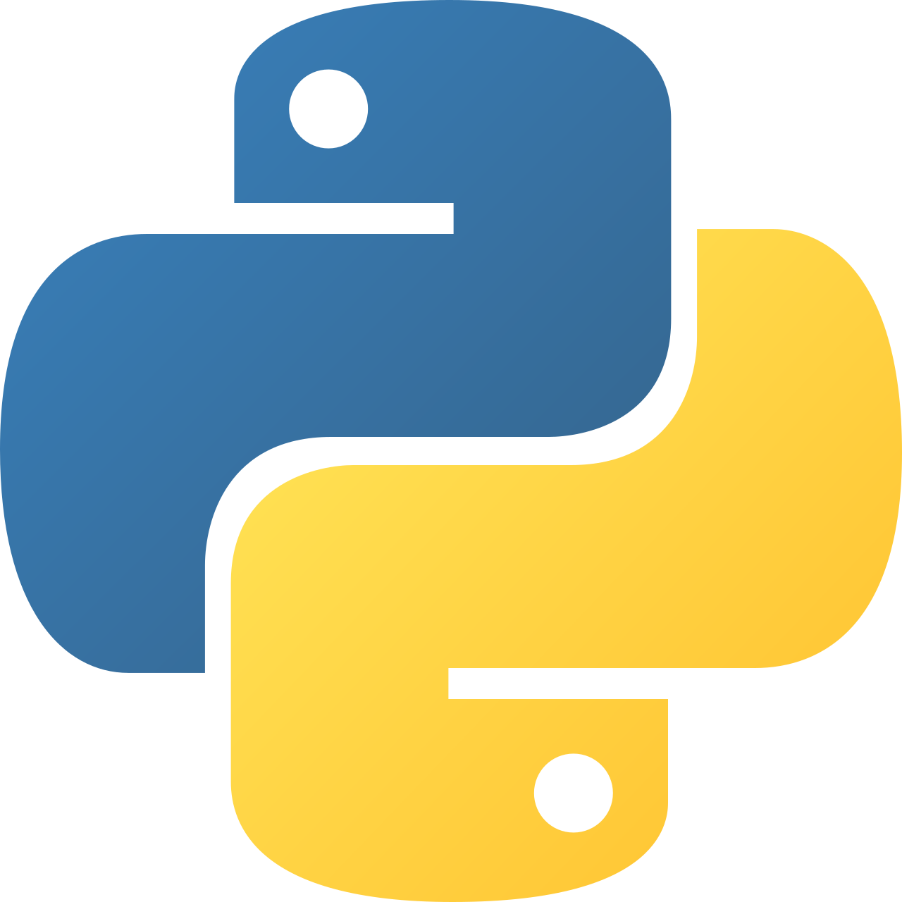

<div align="center">


# Tripplet Sonoma

**Intelligence built to code.**
One workspace for chat, coding, and research — free to start, no account required.

[](https://vibe-coder-analyzer.pages.dev?url=https%3A%2F%2Ftrippletspark.com)


</div>

---

## What is this, actually?

Tripplet is a small, independent AI platform that got a little too ambitious. It started as "a chat app" and is now a chat app, a coding workspace, a live web-search engine, a persistent-memory system, a sandboxed virtual OS, and an AI-fact-checked encyclopedia — all wearing one login screen.

If you've ever wanted ChatGPT, a code sandbox, and Wikipedia to have a baby that also remembers your birthday, this is that baby. We are legally required to also mention it occasionally goes down, because [Warp said so](https://github.com/user-attachments/assets/16fdd176-6ae7-4d5c-9464-e246d2d15891).

## Screenshots

<table>
<tr>
<td width="50%">

**Landing page**


</td>
<td width="50%">

**Sign in**


</td>
</tr>
<tr>
<td width="50%">

**Chat (guest mode)**


</td>
<td width="50%">

**Features**


</td>
</tr>
</table>

> Screenshots were captured with [Playwright](https://playwright.dev) against a local `npm run dev` instance — see [Regenerating the screenshots](#regenerating-the-screenshots) below.

## Core features

| Feature | What it does |
|---|---|
| 💬 **Chat** | Streaming AI conversations with composable modes (`think`, `deep-research`, `web-search`, `study`) and tones (formal, concise, detailed, minimal) |
| 🧑‍💻 **Deep Code** | A multi-stage coding pipeline persona (Astro 5 Code) that plans before it builds |
| 🔎 **Web Search** | Live search results injected straight into the system prompt context (keyless DuckDuckGo fallback when no backend is configured) |
| 🧠 **User Memory** | Persistent, cross-conversation memory via an external backend service |
| 🖥️ **Anura OS** | An experimental agent mode that primes the model for multi-step task execution (prompt-level today; the real in-browser VM is the **Sandboxed Linux** skill) |
| 📚 **Triplepedia** | An AI-fact-checked knowledge base — every article is verified before it publishes |
| ⏱️ **Rate Limiting** | Per-user/IP limiting via a shared Redis/KV store when configured, falling back to an in-memory LRU cache |

## The models

Four in-house personas, each tuned for a different job. The persona **ID** is the stable API identifier — display names can change without breaking saved conversations:

| Model | Persona ID | Best for |
|---|---|---|
| **Astro 5** | `astro-5` | Flagship — top reasoning and range |
| **Taipei 4** | `tura-3` | Advanced reasoning and analysis |
| **Majuli 4** | `majuli-3` | Fast, concise responses |
| **Suzhou 4** | `suzhou-3` | Creative, detailed generation |

There's also **Astro 5 Code** (`astro-5-code`), a staged DeepCode pipeline rather than a single model, plus an opt-in **Legacy Models** tier in Settings. Guest mode gets unlimited enthusiasm but a strict 15-message leash, locked to Suzhou.

## Tech stack

<p>




</p>

- **Frontend**: Next.js 15 (Turbopack) + React 19 + TypeScript
- **Database**: PostgreSQL on [Neon](https://neon.tech), accessed via Prisma ORM and raw `pg` queries
- **Auth**: A first-party JWT system that the UI uses today, plus a fully-mounted-but-unused Better Auth instance sitting quietly in the corner (see `CLAUDE.md` for the full, slightly embarrassing story)
- **AI inference**: Tripplet's own model backends, selected per persona by `resolveBackend()` and streamed as SSE — callers never hardcode a provider URL
- **Testing**: Vitest (unit) + Playwright (E2E) — the same tool that took the screenshots above
- **External backend**: A separate service (`services/backend`, deployed independently) handling memory, combined search, agents, LoopTrain, and the Triplepedia knowledge base

## Getting started

The fastest way in is the interactive **setup TUI** — the same experience on Windows, macOS, and Linux, and it needs nothing but [Node.js](https://nodejs.org) (20 LTS+):

```bash
./setup.sh       # macOS / Linux / Windows (Git Bash or WSL) — no chmod needed, the exec bit ships with the repo
npm run setup    # any OS, any shell (PowerShell/cmd included)
```

From its menu you can:

- **Install** — runs `npm install` right in your terminal and creates `.env` from the template
- **Run the dev server** — pick any port; the server runs in your terminal and your default browser (Chrome, Firefox, Edge, Safari…) opens on it automatically
- **Tutorial** — a step-by-step getting-started guide, one per OS (Windows, macOS, Linux)
- **Customize the app** — app name, tagline, description, default port
- **Model backends** — point any model id at your own OpenAI-compatible endpoint, or add brand-new models to the picker
- **Edit code** — opens the key files in your editor

Prefer doing it by hand? The classic route still works:

```bash
# 1. Install dependencies (Prisma client is generated automatically via postinstall)
npm install

# 2. Copy the environment template and fill in real values
cp .env.template .env

# 3. Run the database setup scripts
npm run setup:db

# 4. Start the dev server (Turbopack-powered)
npm run dev
```

Then open [http://localhost:3000](http://localhost:3000).

### Customizing without touching code

`src/config.md` is the user-editable app config — the dev server reads it on startup:

- **Branding** — app name, tagline, description (window title, sidebar, landing header)
- **Default port** — what `./setup.sh` offers when you run the server
- **Model backends** — each `###` entry routes a model id to an OpenAI-compatible endpoint. An id matching a built-in persona (`astro-5`, `tura-3`, `majuli-3`, `suzhou-3`) reroutes it; a new id adds a brand-new model, and `show in picker: yes` puts it in the model dropdown. API keys never go in the file — each entry names the `.env` variable that holds its key.

Edit it by hand or through `./setup.sh` → *Customize the app* / *Model backends*, then restart the dev server to apply.

### Other useful commands

```bash
npm run build        # Production build (runs Prisma migrations first)
npm run lint          # ESLint
npm run type-check    # TypeScript check (tsc --noEmit)
npm run check:docs    # Doc freshness — referenced repo paths must resolve
npm run test:unit     # Vitest unit tests
npm run test:e2e      # Playwright end-to-end tests
```

### Regenerating the screenshots

The screenshots in this README are generated, not hand-picked — so they can never go stale for long:

```bash
npx playwright install chromium   # first time only
npm run dev &                     # or reuseExistingServer will pick up one already running
node scripts/screenshot-readme.mjs
```

This drives a headless Chromium instance around `/`, `/sign-in`, `/chat`, and `/features`, and drops the results into `assets/screenshots/`. The `/chat` shot is taken from a fresh guest session — no account, no login — so it always shows what a first-time visitor sees.

## Project structure

```
src/
├── app/                  # Next.js App Router — pages & API routes
│   ├── api/              # Chat, auth, uploads, etc.
│   ├── (app)/ (auth)/    # Route groups
│   └── c/                # Individual conversation pages
├── hooks/useChat.ts       # Main chat state, conversation CRUD, streaming
├── lib/
│   ├── ai/               # Models, system prompt builder, chat client
│   ├── auth/             # JWT + Better Auth
│   ├── db/               # Neon/pg raw query layer
│   └── security/         # Rate limiting, sanitization
└── types/index.ts         # Shared TypeScript types
prisma/schema.prisma        # Users, Conversations, Messages, FileUploads, AIUsage
db/schema.sql                # Non-Prisma tables (run via npm run setup:db)
```

## Documentation

- `CLAUDE.md` / `AGENTS.md` — architecture notes for AI coding assistants working in this repo
- `docs/wiki/` — architecture, models, auth, and deployment guides
- `docs/audits/` — dated engineering audits (security findings, architecture review)
- `docs/` — additional project documentation

## Known quirks (we're not hiding them)

- Two auth systems coexist: the UI calls the first-party JWT routes, while Better Auth is fully configured and completely unused.
- `neon_auth` is a leftover schema from a Supabase→Neon migration — it's not live, don't build against it.
- Model names have moved around a lot (Taipei 3 → 3.1 → 4, etc.), but persona IDs stay stable so saved conversations never break — see `docs/wiki/Models-and-Personas.md`.
- Image/video generation and vision are currently disabled stubs (`analyzeImage()` throws) — the routes exist but return an error.

## Contributing

This is a private, actively-iterated project. If you have access to the repo, read `CLAUDE.md` first — it documents the UI rules, codewords, and architecture decisions that keep the platform from tripping over itself.

---

<div align="center">
Made with equal parts ambition and caffeine. ☕
</div>
