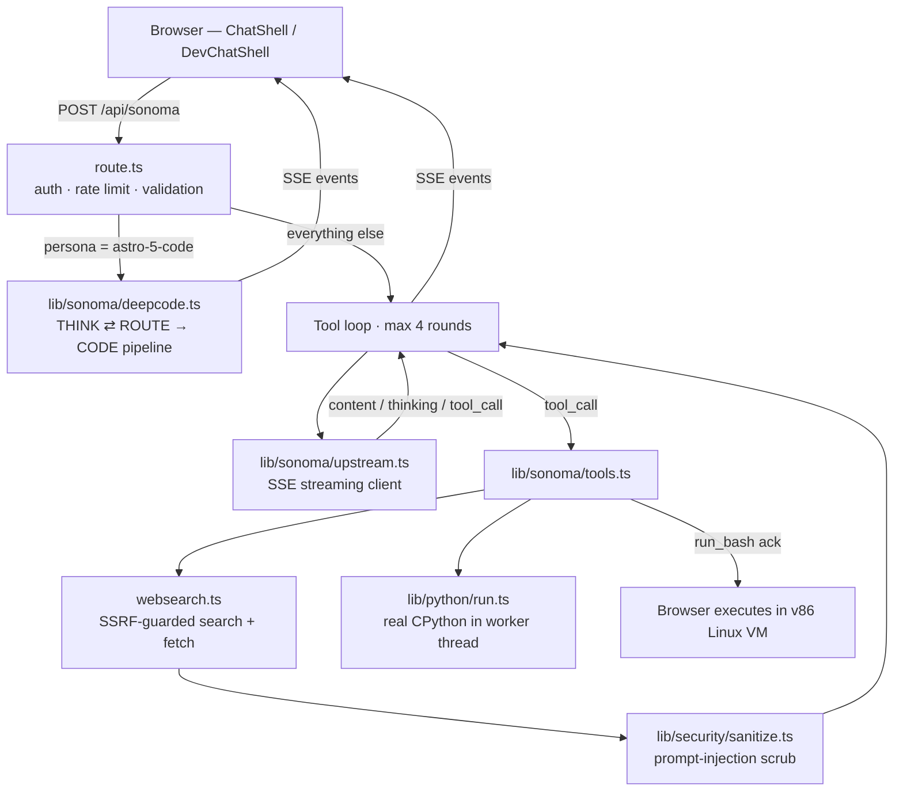

# Architecture

How a Sonoma chat request actually flows, and where each responsibility lives.
(For persona/product docs see the [README](../README.md); for agent-facing
rules see [CLAUDE.md](../CLAUDE.md).)

## Request flow

Client-side, `lib/sonoma/stream.ts` is the single reader for that SSE stream
(both shells share it): it dispatches `thinking` / `content` / `activity` /
`error` events and owns the activity-card merge + timing logic.

## Module map

| Layer | Module | Responsibility |
|---|---|---|
| Route | `src/app/api/sonoma/route.ts` | Auth (optional → guest), rate limits, payload validation, backend selection, the tool loop. Deliberately thin. |
| Prompt | `src/lib/sonoma/prompt.ts` | Composes the system prompt from workspace page, toggles, persona identity (`lib/ai/model-prompts.ts`). Pure string assembly. |
| Upstream | `src/lib/sonoma/upstream.ts` | OpenAI-compatible SSE client; accumulates split tool-call fragments; never leaks provider error bodies to clients. |
| Tools | `src/lib/sonoma/tools.ts` | Tool schemas + execution. External content passes through the injection sanitizer before entering model context. |
| DeepCode | `src/lib/sonoma/deepcode.ts` | Staged thinker→router→coder pipeline with one shared wall-clock budget so the platform can't kill it mid-answer. |
| Python | `src/lib/python/run.ts` | Pyodide (real CPython/WASM) in a memory-capped worker thread with a hard `terminate()` timeout. |
| Search | `src/lib/ai/websearch.ts` | Backend search when configured, keyless DuckDuckGo fallback; SSRF guard re-validates every redirect hop. |
| Security | `src/lib/security/` | Rate limiting (shared Redis via REST when configured, per-instance LRU otherwise), injection sanitizer. |
| Auth | `src/lib/auth/` | First-party JWT (bcrypt + HS256 `jose` cookie); `auth()` degrades to guest on any failure. |
| Sandbox | `src/lib/sandbox/trippletLinux.ts` | v86 x86 Linux VM in the browser; serialized command queue over the serial tty; pre-booted for warm `run_bash`. |

## Trust boundaries

1. **Client → server**: every payload is validated (roles, sizes, counts);
   client-supplied `system` messages are stripped.
2. **Model → tools**: tool arguments are model-chosen from untrusted context —
   hence the SSRF guard on fetches and the WASM/worker isolation on Python.
3. **Web → model**: search/fetch results are sanitized (directive stripping,
   envelope-tag removal) before entering context, and the system prompt
   declares them untrusted.
4. **Server → client**: upstream provider names/errors stay server-side; the
   client only ever sees persona ids.

## Deployment notes

- Vercel serverless. Files read from disk at runtime (`sprompts/`,
  `assets/faces/`, pyodide) are traced per-route in `next.config.mjs`.
- `OUTAGE_ACTIVE` (`src/lib/outage.ts`) is the site-wide kill switch; it also
  gates the `/dev` panel and its cookie-authenticated backend override.
- Rate limits become globally consistent when Upstash/Vercel KV REST env vars
  are present; otherwise they are per-instance abuse brakes.
